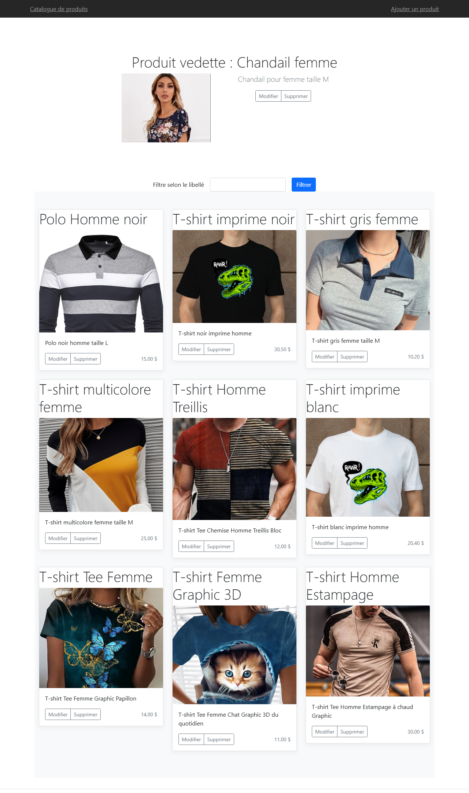
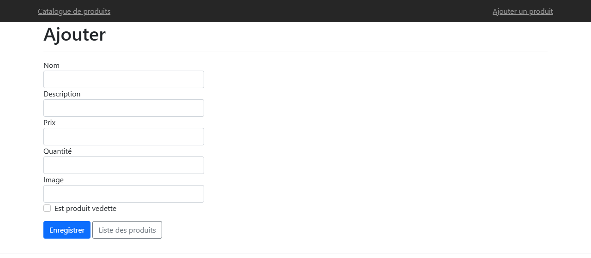
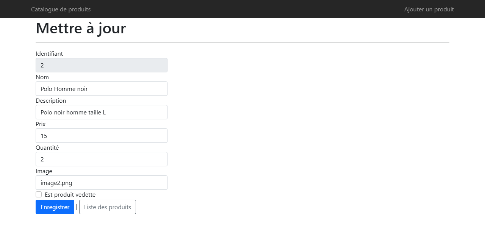
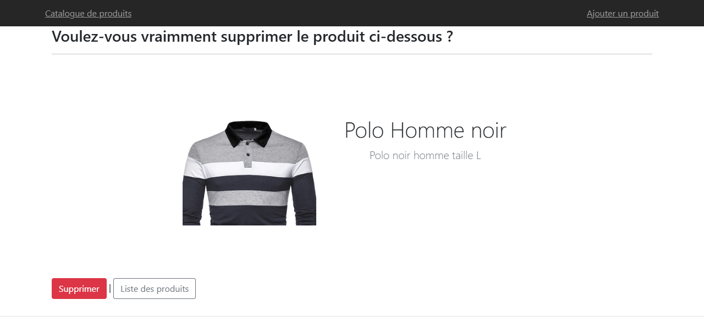

# stockroom

Un catalogue de vêtements : on consulte, on ajoute, on modifie, on supprime.
Les produits vivent dans un fichier CSV, et l'un d'eux est mis en avant.

ASP.NET Core 8 MVC, Bootstrap, aucune base de données.

## Captures

**Accueil**



**Ajout d'un produit**



**Modification**



**Suppression**



## Ce que fait l'application

**Un seul produit vedette.** Il paraît en haut de l'accueil avec sa photo et
sa description. Cocher la case sur un autre produit le lui retire.

**Le produit vedette est protégé.** Il ne se modifie pas et ne se supprime
pas ; la page affiche la raison du refus.

**Le filtre.** Le champ de l'accueil garde les produits dont le nom contient
le texte saisi.

**Le fichier comme stockage.** Une ligne par produit, sept champs séparés par
des points-virgules. Les lectures et les écritures sont asynchrones.

**Les validations.** Le nom n'accepte ni chiffres ni caractères spéciaux et
s'arrête à cent caractères, la description à deux cent cinquante, le prix est
positif avec deux décimales au plus, la quantité va de zéro à cent cinquante,
et le nom de l'image doit finir par `.png` ou `.jpg`.

## Le faire tourner

```bash
cd Produits.MVC
dotnet run
```

Le catalogue s'ouvre sur `https://localhost:7225`. Le fichier `produits.csv`
est lu à la racine du projet ; son nom se change dans `appsettings.json`.

## Licence

MIT. Voir [LICENSE](LICENSE).
